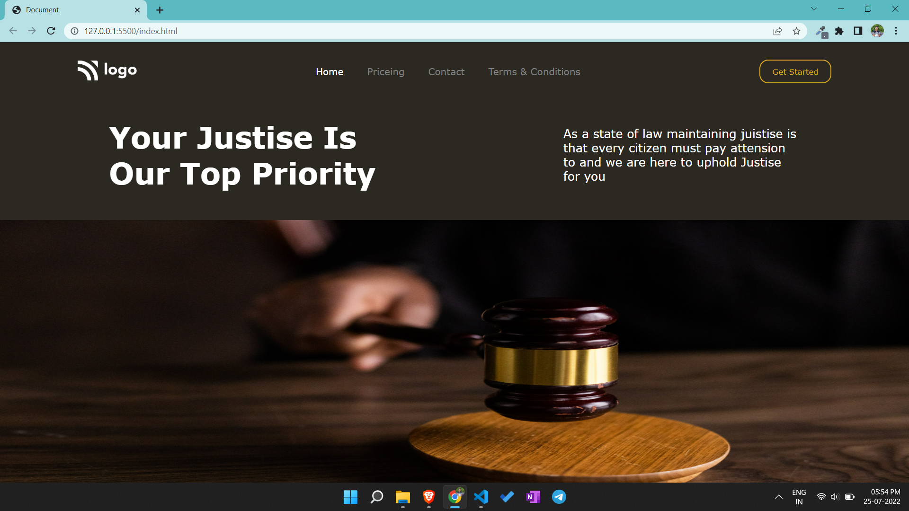

# Portfolio project 3

This is a one page portfolio template project made in HTML and CSS.

# Project live link

[Portfolio-project-3](https://jolly-swan-768ba0.netlify.app)

# Screenshot

# My learnings from this projects

- I learned about flex box and adjusting the image and list items in navbar.

# Time to finish the project

I took about 2.5 hours approximately to complete this project.
